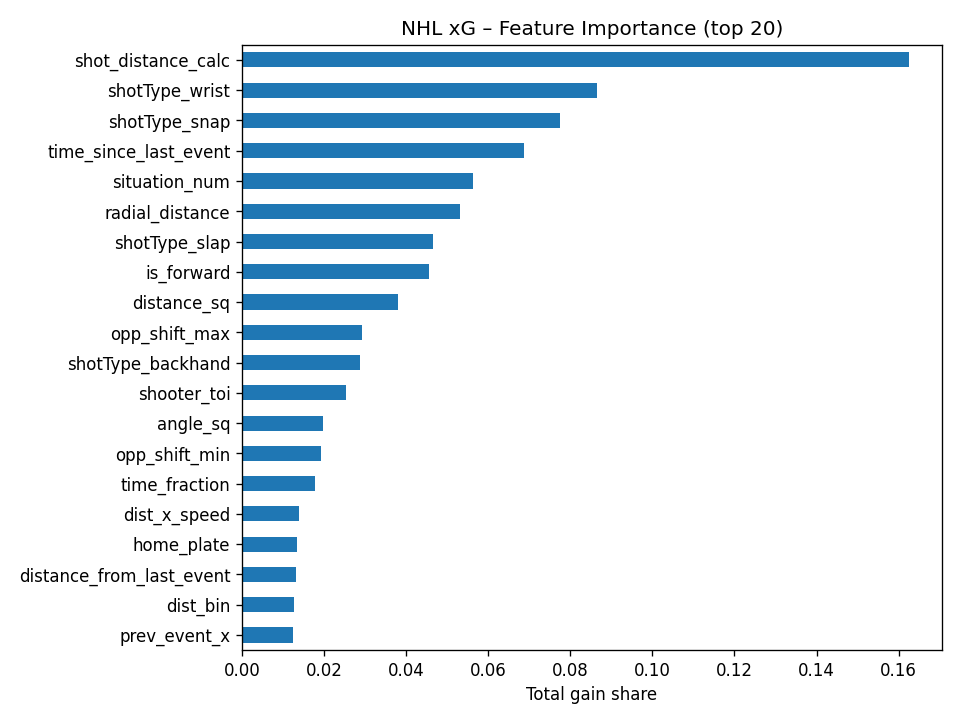
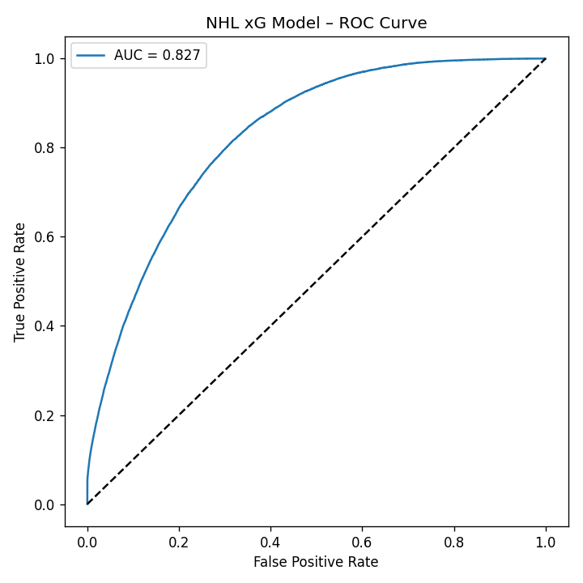
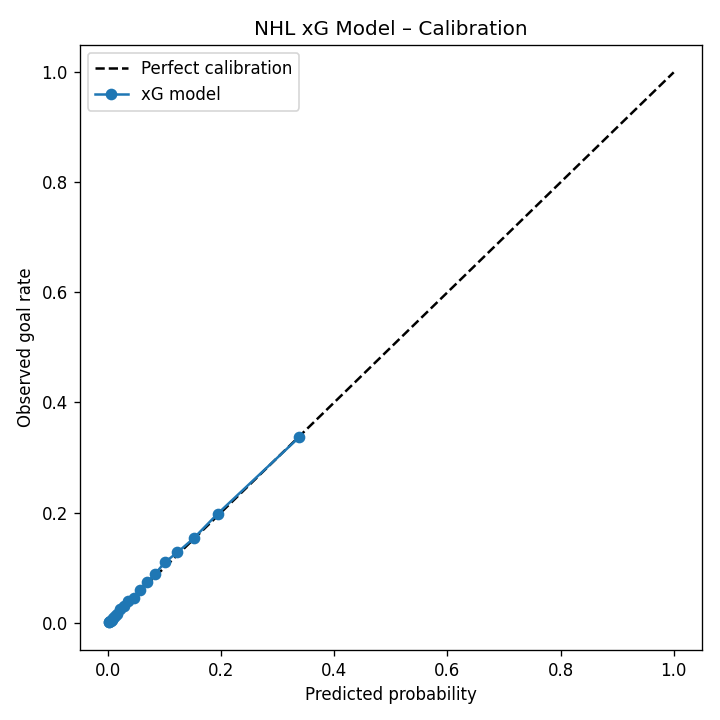

# 🏒 Model Specifics & Results

**Shot population:** SOG + blocked shots + goals (no missed shots — missed shots lack `shotType` in the NHL API)  
**Training seasons:** 2013-14 → 2021-22 · **Test seasons:** 2022-23, 2023-24, 2024-25  
**Algorithm:** XGBoost (GPU random search, 20 trials, 4-fold stratified CV) inside an imbalanced-learn pipeline

---

## Feature Set (56 columns)

| Group              | Features                                                                                                                                                 | Rationale                                                                               |
| ------------------ | -------------------------------------------------------------------------------------------------------------------------------------------------------- | --------------------------------------------------------------------------------------- |
| **Geometry**       | `shot_distance_calc`, `shot_angle_calc`, `distance_sq`, `angle_sq`, `dist_x_angle`, `log_distance`, `radial_distance`, `dist_bin`                        | Core physics of shooting — distance and angle dominate xG in every model.               |
| **Spatial zones**  | `in_slot`, `home_plate`, `behind_net`                                                                                                                    | Encodes high-danger areas per coaching guidelines.                                      |
| **Context / Flow** | `time_since_last_event`, `distance_from_last_event`, `delta_x`, `delta_y`, `movement_speed`, `movement_angle`, `dist_x_speed`, `time_fraction`, `period` | Captures rush chances, rebounds, fatigue, and game clock.                               |
| **Rebound / Rush** | `is_rebound`, `is_rush`, `is_cross_ice`, `rebound_x_dist`                                                                                                | Flags the most dangerous shot opportunities.                                            |
| **Prior event**    | `prev_event_x`, `prev_event_y`, `same_event_team`, `last_event_*` (one-hot)                                                                              | Absolute OZ position of the preceding event; distinguishes slot passes from rim passes. |
| **Game state**     | `situation_num` (0=5v5, 1=PP, 2=PK, 3=EN), score-diff buckets (down2+, down1, tie, up1, up2+), `period`                                                  | Separates PP shots from 5v5; desperation shots from settled play.                       |
| **Shift / TOI**    | `shooter_toi`, `opp_shift_min`, `opp_shift_avg`, `opp_shift_max`                                                                                         | On-ice skater counts from shift lookup — how tired are the defenders?                   |
| **Era flags**      | `era_pre2014`, `era_2014`, `era_2019`, `era_2022`                                                                                                        | Rule-change eras affect scoring rates independently of shot quality.                    |
| **Shot mechanics** | `shotType_wrist`, `shotType_snap`, `shotType_slap`, `shotType_backhand` (one-hot)                                                                        | Lets the model learn different success rates per technique.                             |
| **Shooter**        | `is_forward`                                                                                                                                             | Forwards and defencemen shoot from different locations and with different intentions.   |

---

## Top 10 Features by XGBoost Total Gain

| Rank | Feature                 | % of Total Gain |
| ---- | ----------------------- | --------------- |
| 1    | `shot_distance_calc`    | 16.25%          |
| 2    | `shotType_wrist`        | 8.64%           |
| 3    | `shotType_snap`         | 7.74%           |
| 4    | `time_since_last_event` | 6.87%           |
| 5    | `situation_num`         | 5.63%           |
| 6    | `radial_distance`       | 5.32%           |
| 7    | `shotType_slap`         | 4.66%           |
| 8    | `is_forward`            | 4.56%           |
| 9    | `distance_sq`           | 3.80%           |
| 10   | `opp_shift_max`         | 2.93%           |



---

## Hold-out Performance (2022-23 to 2024-25)

### Current Best Model

| Situation      | Goal%    | AUC        | LogLoss    | Brier      | Calib%    |
| -------------- | -------- | ---------- | ---------- | ---------- | --------- |
| 5v5            | 5.7%     | **0.8252** | 0.1784     | 0.0486     | 97.2%     |
| PP             | 9.2%     | **0.7616** | 0.2674     | 0.0772     | 103.3%    |
| PK             | 7.8%     | **0.8421** | 0.2164     | 0.0633     | 97.9%     |
| **Overall\***  | **6.3%** | **0.8175** | **0.1940** | **0.0537** | **98.7%** |
| EN (info only) | 68.9%    | 0.9883     | 0.1868     | 0.0487     | 88.4%     |

\* 5v5 + PP + PK combined · EN excluded from AUC (trivially easy)

### ROC Curve

The model cleanly separates made vs. missed shots across all situations.



### Reliability Diagram

Calibration is tight (Overall Calib% = 98.7%): predicted probabilities closely track observed goal rates.



## Reproducing the Best Result

```bash
# Full pipeline in one command (all seasons)
python main.py --full-pipeline --download --full-history --retrain --tag best-model

# Or step by step:

# 1. Download raw data
python main.py --download --full-history

# 2. Build shot CSV
python main.py --export-shots --skip-fetch

# 3. Build shift lookup
python main.py --build-shifts --skip-fetch

# 4. Train and evaluate
python main.py --evaluate --retrain --tag new-features --skip-fetch
```
